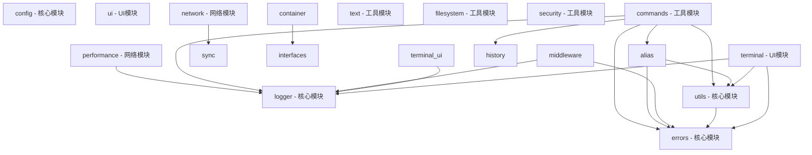

# ClixGo 项目依赖关系分析

## 模块依赖关系详情

### cmd/cli
**内部依赖:**
- cmd/task
- pkg/alias
- pkg/commands
- pkg/completion
- pkg/config
- pkg/filesystem
- pkg/history
- pkg/logger
- pkg/network
- pkg/security
- pkg/terminal
- pkg/text
- pkg/utils
**外部依赖:**
- github.com/spf13/cobra
- go.uber.org/zap
- text/tabwriter

### cmd/netmonitor
**内部依赖:**
- pkg/network
**外部依赖:**
- flag

### cmd/perfmonitor
**内部依赖:**
- pkg/performance
- pkg/task
**外部依赖:**
- flag
- go.uber.org/zap

### cmd/task
**内部依赖:**
- pkg/task
**外部依赖:**
- github.com/spf13/cobra
- go.uber.org/zap

### cmd/testseg
**外部依赖:**
- github.com/yanyiwu/gojieba

### pkg/alias
**内部依赖:**
- pkg/errors
- pkg/utils

### pkg/commands
**内部依赖:**
- pkg/alias
- pkg/errors
- pkg/history
- pkg/logger
- pkg/utils
**外部依赖:**
- go.uber.org/zap

### pkg/completion
**外部依赖:**
- github.com/spf13/cobra

### pkg/config
**外部依赖:**
- github.com/spf13/viper

### pkg/container
**内部依赖:**
- pkg/interfaces

### pkg/engine

### pkg/errors

### pkg/filesystem
**外部依赖:**
- archive/tar
- archive/zip
- compress/gzip
- crypto/md5
- crypto/sha1
- crypto/sha256
- encoding/hex

### pkg/history

### pkg/interfaces
**外部依赖:**
- go.uber.org/zap

### pkg/logger
**外部依赖:**
- go.uber.org/zap
- go.uber.org/zap/zapcore

### pkg/middleware
**内部依赖:**
- pkg/errors
- pkg/logger
**外部依赖:**
- go.uber.org/zap

### pkg/network
**内部依赖:**
- pkg/sync
**外部依赖:**
- crypto/tls
- github.com/eclipse/paho.mqtt.golang
- github.com/gdamore/tcell/v2
- github.com/go-ping/ping
- github.com/gorilla/websocket
- github.com/rivo/tview
- github.com/schollz/progressbar/v3
- go.uber.org/zap

### pkg/performance
**内部依赖:**
- pkg/logger
**外部依赖:**
- github.com/pkg/errors
- github.com/shirou/gopsutil/v3/cpu
- github.com/shirou/gopsutil/v3/mem
- github.com/shirou/gopsutil/v3/process
- go.uber.org/zap

### pkg/plugin
**外部依赖:**
- github.com/spf13/cobra
- plugin

### pkg/security

### pkg/sync
**外部依赖:**
- github.com/google/uuid
- go.uber.org/zap

### pkg/task
**外部依赖:**
- github.com/google/uuid
- github.com/pkg/errors
- go.uber.org/zap

### pkg/terminal
**内部依赖:**
- pkg/errors
- pkg/logger
- pkg/utils
**外部依赖:**
- github.com/creack/pty
- github.com/google/uuid
- go.uber.org/zap
- golang.org/x/term

### pkg/terminal/ui
**内部依赖:**
- pkg/logger
**外部依赖:**
- github.com/gdamore/tcell/v2
- github.com/rivo/tview
- go.uber.org/zap

### pkg/text
**外部依赖:**
- github.com/yanyiwu/gojieba
- regexp

### pkg/ui
**外部依赖:**
- github.com/AlecAivazis/survey/v2
- github.com/fatih/color
- github.com/jedib0t/go-pretty/v6/table
- github.com/schollz/progressbar/v3

### pkg/utils
**内部依赖:**
- pkg/errors

## ✅ 循环依赖检查
未发现循环依赖问题
## 🔧 模块解耦优化建议

### 1. 高依赖模块 (需要重构)
- **cmd/cli**: 13个依赖

### 2. 被高度依赖的模块 (需要稳定化)
- **pkg/errors**: 被5个模块依赖
- **pkg/utils**: 被4个模块依赖
- **pkg/logger**: 被6个模块依赖

### 3. 建议的解耦策略
- **接口抽象**: 为被高度依赖的模块定义接口
- **依赖注入**: 使用依赖注入减少直接依赖
- **事件驱动**: 使用事件机制解耦模块间通信
- **分层架构**: 建立清晰的分层结构

## 📊 依赖关系图表 (Mermaid)

